# 企业网站常用 Section 布局案例

一套面向 **企业官网、B2B 网站、建材品牌站、产品展示站和 WordPress 项目** 的响应式 Section 布局组件实验库。

项目包含 11 个独立区块案例，涵盖工程案例、产品展示、颜色切换、荣誉资质、发展历程、企业文化、项目图库、产品优势、Footer、时间轴和产品表面纹理展示等常见企业网站场景。

本项目不依赖 Bootstrap，主要使用：

- HTML5
- 原生 CSS
- CSS Grid / Flexbox
- 原生 JavaScript
- 本地 Swiper

所有案例均按“**独立 Section 组件**”方式开发，强调：

> **独立、可复制、可维护、可迁移、适合长期复用。**

---

## 项目特点

### 1. 每个案例都是独立 Section

11 个案例分别使用：

```text
#section01
#section02
#section03
...
#section11
```

每个案例的 CSS 都以对应 Section ID 作为作用域，例如：

```css
#section01 .inner {}
#section01 .title {}
#section01 .item {}
```

这样即使多个 Section 同时放在一个页面中，也不容易发生样式污染。

后期正式使用时，可以直接全局批量替换：

```text
section01
↓
project-cases
```

HTML、CSS 和 JavaScript 中的作用域都可以一起更新。

---

### 2. 内部类名保持简单

组件内部尽量使用：

```text
.inner
.head
.title
.desc
.grid
.item
.media
.image
.content
.nav
.btn
```

避免过度复杂的类名体系。

由于每个组件都有独立的 Section ID 作为作用域，因此可以在保持代码简洁的同时，减少和其他模块发生冲突的风险。

---

### 3. 默认内容宽度 1140px

项目参考常见企业站以及 Bootstrap 的经典内容宽度体系，但 **不依赖 Bootstrap**。

主要内容区域统一采用：

```css
width: min(calc(100% - 40px), 1140px);
margin-inline: auto;
```

手机端通常保留约：

```text
16px
```

左右安全间距。

---

### 4. 优先原生 CSS，必要时才使用 Swiper

简单布局优先使用：

```text
CSS Grid
Flexbox
aspect-ratio
object-fit
CSS Variables
Media Queries
```

只有在真正需要：

- 左右滑动
- 自动轮播
- 手机手势
- 分页圆点
- Gallery
- Timeline

时才使用 Swiper。

Swiper 已保存为本地文件，不依赖 CDN。

---

### 5. 适合迁移到 WordPress

这些 Section 不只是静态 HTML Demo。

组件结构尽量保持：

```text
内容数据
↓
HTML / WordPress

交互
↓
JavaScript

布局和视觉
↓
CSS
```

因此后期可以逐步迁移到：

- WordPress 自定义主题
- Gutenberg Block
- Custom Post Type
- WordPress Template Part
- WooCommerce 产品页面
- 普通 PHP 网站
- 其他静态 HTML 项目

---

# 目录建议

```text
project/
│
├── index.html
├── README.md
│
├── docs/
│   ├── section01.png
│   ├── section02.png
│   ├── section03.png
│   ├── section04.png
│   ├── section05.png
│   ├── section06.png
│   ├── section07.png
│   ├── section08.png
│   ├── section09.png
│   ├── section10.png
│   └── section11.png
│
├── section01-project-cases/
├── section02-featured-products/
├── section03-color-cards/
├── section04-certificates/
├── section05-company-timeline/
├── section06-corporate-culture/
├── section07-project-gallery/
├── section08-product-advantages/
├── section09-site-footer/
├── section10-development-timeline/
└── section11-surface-texture-display/
```

> `docs/section01.png ~ docs/section11.png` 为各案例效果截图，可自行替换为真实预览图。

---

# Section 01：工程案例分类切换

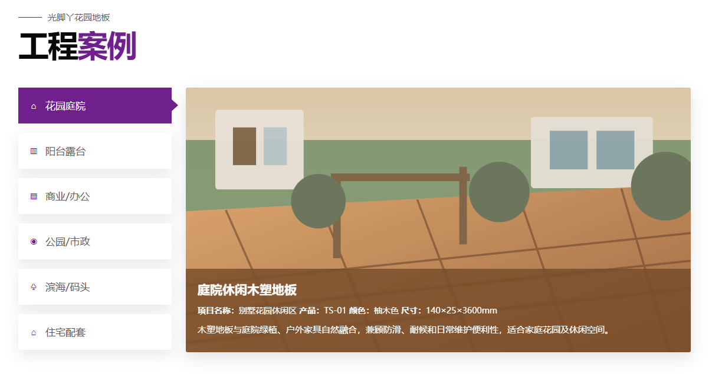

## 效果说明

左侧为工程案例分类导航，右侧展示当前分类对应的项目图片、产品型号、颜色、尺寸和项目说明。

桌面端采用左右两栏结构，手机端改为更适合触摸操作的 **2 列分类菜单 + 单列案例卡片**。

## 亮点

- 分类 Tabs 与内容面板联动
- 默认状态由 HTML 控制
- 手机端分类一次全部显示
- 图片区域固定高度
- 底部文字层覆盖在图片上
- 不同文字长度不会改变整体视觉结构
- JS 只在 `#section01` 内部运行

## 应用场景

适合：

- 工程案例
- 项目案例
- 产品应用场景
- 建筑案例
- 园林景观案例
- 产品分类展示

## 技术

```text
HTML5
CSS Grid / Flexbox
原生 JavaScript
object-fit
Responsive Media Query
```

---

# Section 02：热销产品交错展示

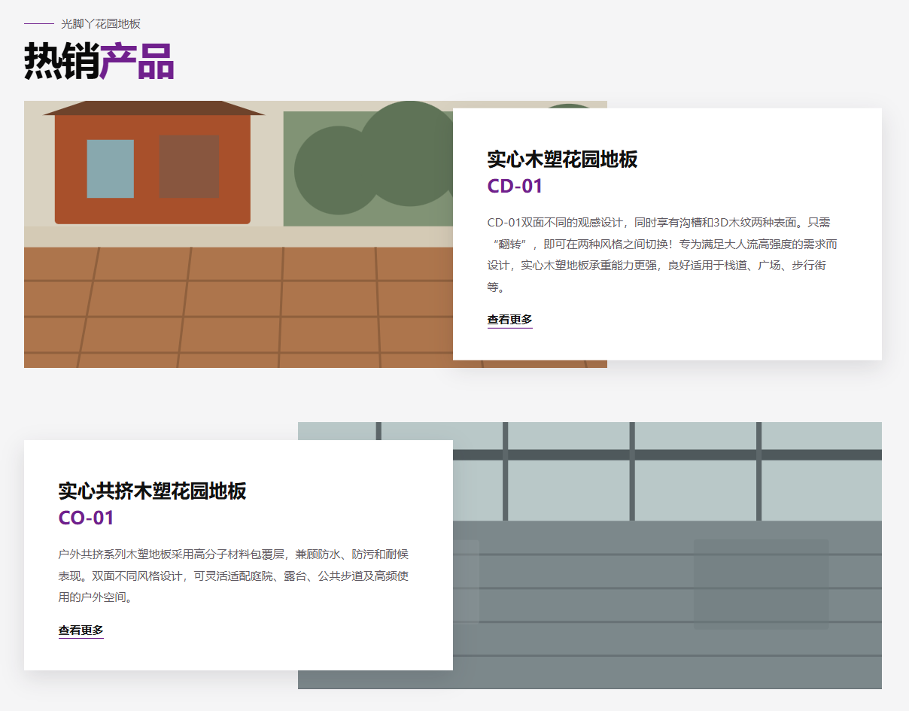

## 效果说明

使用大幅产品场景图配合悬浮文字卡片，多个产品上下排列，并通过左右交错布局形成视觉节奏。

每个产品结构保持非常简单：

```text
一张大图
+
一个文字卡片
```

## 亮点

- 左右交错式产品布局
- 文字卡片和大图垂直居中
- 图片与文字层自然重叠
- 手机端自动转换为上下布局
- 无额外 JS
- 一张完整大图即可完成一个产品展示

## 应用场景

适合：

- 热销产品
- 推荐产品
- 产品系列
- 产品解决方案
- 新品推荐
- 企业首页核心产品展示

## 技术

```text
HTML5
CSS Position
CSS Grid
Responsive Layout
object-fit
```

---

# Section 03：产品颜色 / 色卡联动轮播

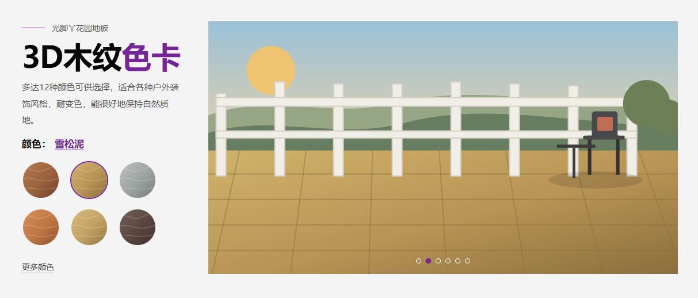

## 效果说明

左侧显示多个圆形产品色卡，右侧展示对应场景大图。

用户可以：

- 点击色卡切换
- 点击分页圆点
- 手机左右滑动
- 自动轮播

右侧图片使用 Swiper Fade 效果，适合对比同一场景下不同产品颜色。

## 亮点

- 色卡与 Swiper 双向同步
- Fade 淡入淡出
- 自动轮播
- 用户主动操作后停止自动播放
- 默认色卡由 HTML `is-active` 决定
- 不将产品数据写进 JS
- 本地 Swiper

## 应用场景

适合：

- 地板颜色
- 墙板颜色
- 家具饰面
- 门窗颜色
- 石材颜色
- 材质色板
- 产品外观选色

## 技术

```text
HTML5
CSS
原生 JavaScript
Swiper
Fade Effect
Autoplay
Responsive Layout
```

---

# Section 04：荣誉资质 / 证书轮播

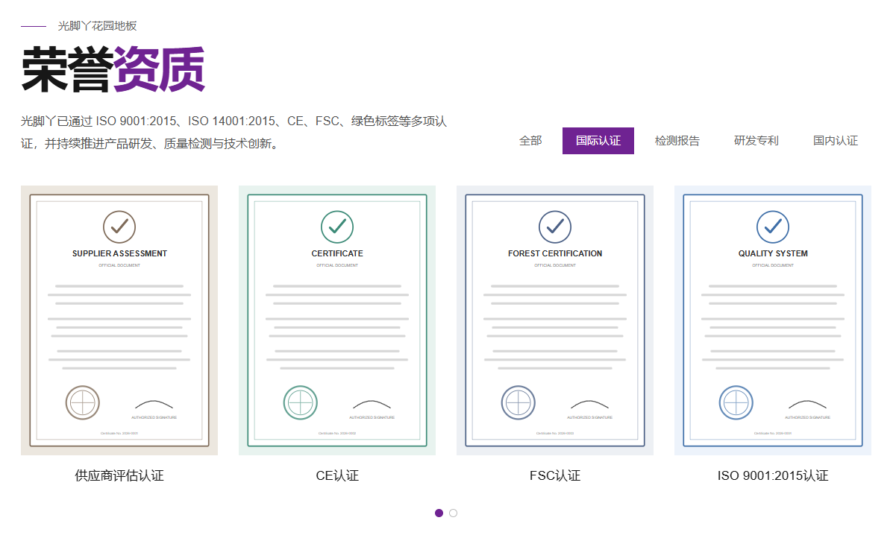

## 效果说明

顶部提供证书分类切换，下方以 Swiper 展示对应分类的荣誉证书。

桌面端一次显示多张证书，手机端自动变为单张显示。

点击证书后，可以打开大图 Modal 查看。

## 亮点

- 分类 Tabs
- 多证书 Swiper
- 桌面 / 平板 / 手机不同 `slidesPerView`
- 点击证书放大
- 支持遮罩关闭
- 支持 Esc 关闭
- 弹窗打开时锁定页面滚动
- 本地 Swiper

## 应用场景

适合：

- 企业资质
- 荣誉证书
- 产品认证
- 国际认证
- 专利展示
- 检测报告
- 企业荣誉

## 技术

```text
HTML5
CSS Grid
原生 JavaScript
Swiper
Modal
Keyboard Accessibility
```

---

# Section 05：图片式发展历程

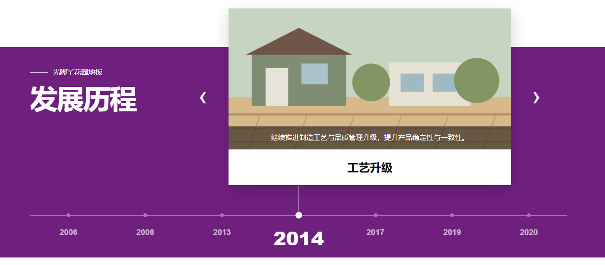

## 效果说明

以大幅图片 + 当前发展阶段为核心，上方展示当前阶段内容，下方为年份时间轴。

年份和主内容联动，当前年份始终保持醒目，并通过连接线与当前卡片建立视觉联系。

## 亮点

- 主内容 Swiper
- 年份 Timeline Swiper
- 两个 Swiper 联动
- 点击年份切换
- 左右箭头切换
- 手机手势滑动
- 当前年份高亮
- 时间轴动态移动
- 卡片与年份之间有连接线

## 应用场景

适合：

- 企业发展历程
- 品牌故事
- 产品迭代历史
- 企业重大事件
- 公司里程碑
- 年度发展节点

## 技术

```text
HTML5
CSS
原生 JavaScript
Swiper
Swiper Sync
Timeline UI
Responsive Design
```

---

# Section 06：企业文化 Hover 卡片

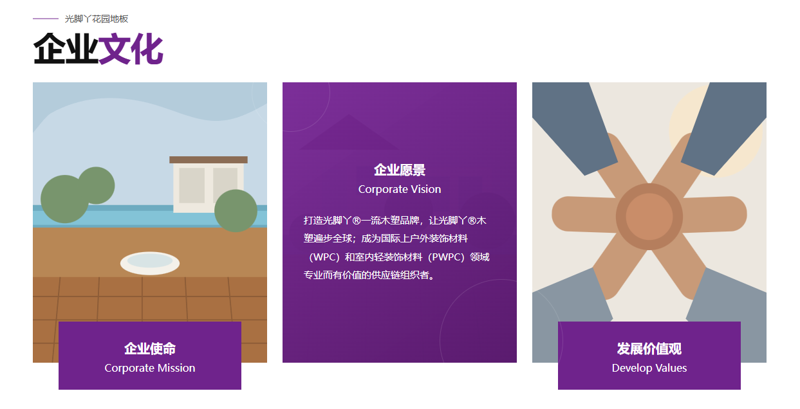

## 效果说明

三张企业文化卡片默认显示：

```text
图片
+
底部标题卡
```

鼠标 Hover 当前卡片后：

```text
紫色覆盖层
+
标题
+
英文名称
+
详细说明
```

三张卡片的结构完全统一。

## 亮点

- 三卡片统一结构
- Hover 图片遮罩
- 图文自然切换
- 图片轻微放大
- 无 JavaScript
- 手机端不依赖 Hover

## 应用场景

适合：

- 企业使命
- 企业愿景
- 企业价值观
- 品牌理念
- 企业文化
- 服务理念

## 技术

```text
HTML5
CSS Grid
CSS Overlay
CSS Transition
Responsive Layout
```

---

# Section 07：工程案例图库 + 详情 Modal

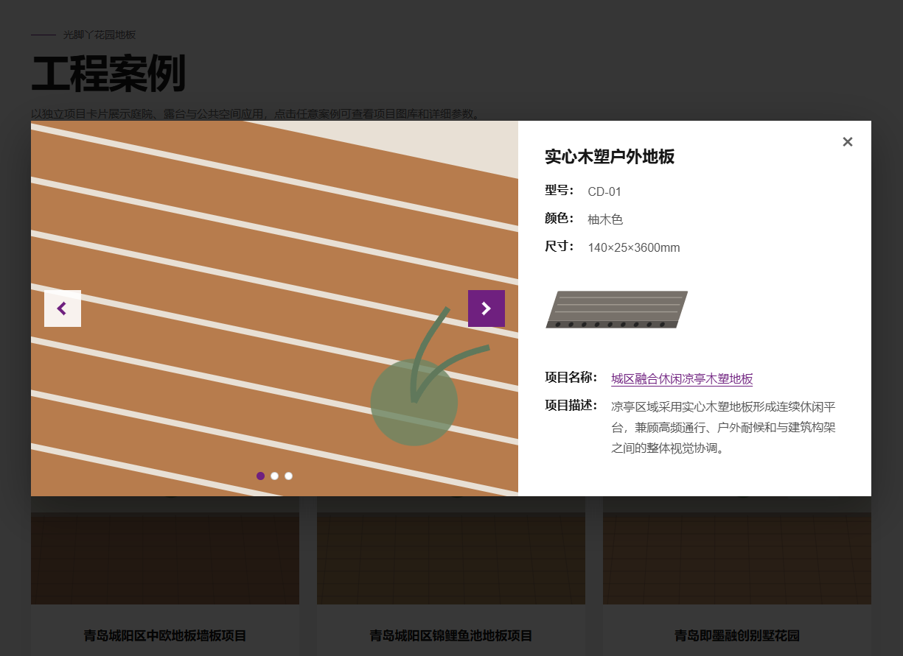

## 效果说明

默认展示工程案例 Grid。

点击任意项目后，打开详情弹窗：

```text
左侧
→ 项目图片 Gallery

右侧
→ 产品名称
→ 型号
→ 颜色
→ 尺寸
→ 产品图片
→ 项目名称
→ 项目说明
```

## 亮点

- 项目 Grid
- 原生 Modal
- Modal 内部 Swiper Gallery
- 左右箭头
- 分页圆点
- 点击遮罩关闭
- Esc 关闭
- 页面滚动锁定
- 焦点恢复
- `<template>` 保存每个项目详情
- JS 不保存业务数据

## 应用场景

适合：

- 工程案例
- 项目图库
- Portfolio
- 建筑案例
- 装修项目
- 景观项目
- 产品安装案例
- Before / After

## 技术

```text
HTML5
CSS Grid
原生 JavaScript
HTML <template>
Modal
Swiper Gallery
Responsive Layout
```

## WordPress 扩展方向

Section 07 特别适合迁移为：

```text
Project CPT
+
数字分页
+
每页约 12 个案例
+
每个项目自带 <template>
+
Modal
+
真实 permalink
```

在这种规模下不需要 AJAX。

普通点击打开 Modal，同时保留真实详情页 URL，兼顾：

- SEO
- 分享
- 新窗口访问
- JS 失效回退
- 独立详情页

---

# Section 08：产品优势 Hover 卡片

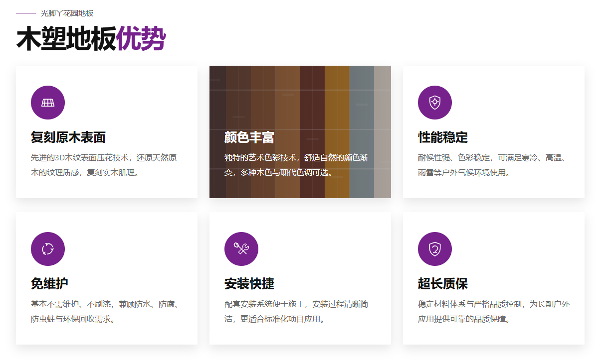

## 效果说明

默认显示：

```text
图标
+
优势标题
+
简短说明
```

Hover 后：

```text
对应背景图片
+
暗色蒙层
+
白色标题
+
白色说明
```

同时默认图标隐藏。

## 亮点

- 纯 CSS Hover
- 每张卡片独立背景图
- 背景图通过真实 `` 节点加载
- 图片轻微放大
- 图标淡出
- 文字颜色自动切换
- 无 JavaScript
- 手机端保持默认完整内容

## 应用场景

适合：

- 产品优势
- 核心卖点
- 产品性能
- 品牌优势
- 服务优势
- 技术特点
- Why Choose Us

## 技术

```text
HTML5
CSS Grid
CSS Overlay
CSS Transition
object-fit
Responsive Layout
```

---

# Section 09：企业网站 Footer

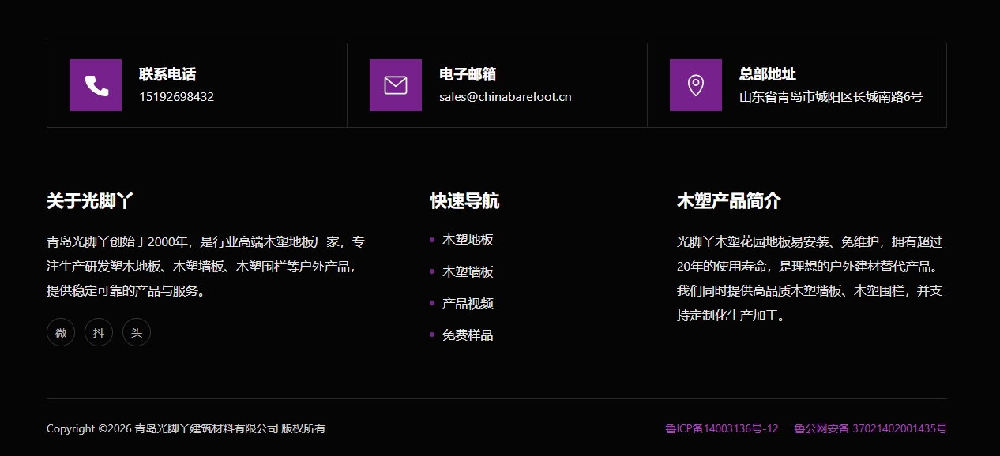

## 效果说明

一个适合企业官网使用的完整 Footer，包括：

```text
顶部
→ 电话
→ 邮箱
→ 地址

中部
→ 关于我们
→ 快速导航
→ 产品简介

底部
→ Copyright
→ ICP
→ 公安备案
```

## 亮点

- 企业网站标准 Footer 结构
- 联系方式清晰
- 多列导航
- 内联 SVG 图标
- 平板和手机自动重排
- 无 JavaScript
- 适合直接进入 WordPress Footer 模板

## 应用场景

适合：

- 企业官网
- B2B 网站
- 品牌站
- WordPress Footer
- 产品官网
- 外贸网站

## 技术

```text
HTML5
CSS Grid
Flexbox
Inline SVG
Responsive Layout
```

---

# Section 10：卡片式发展历程

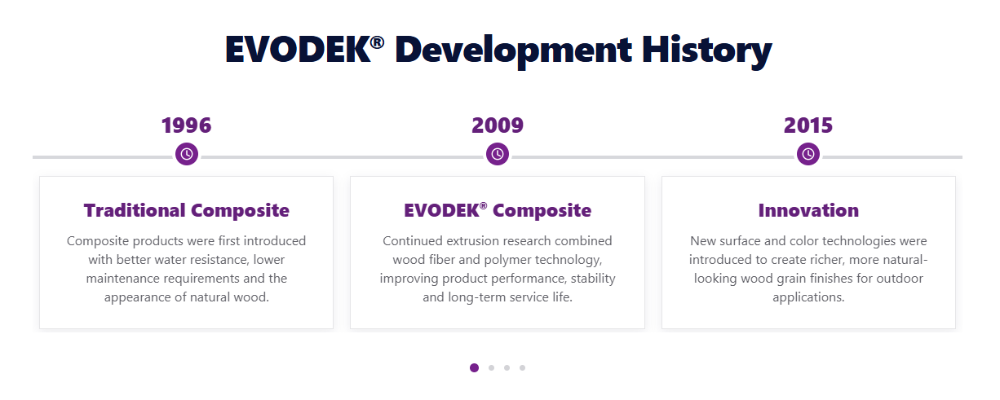

## 效果说明

与 Section 05 不同，本案例采用“多年份同时展示”的信息型 Timeline。

结构：

```text
年份
↓
圆形时间节点
↓
横向时间线
↓
事件卡片
```

桌面端一次显示 3 个节点，平板 2 个，手机 1 个。

## 亮点

- 横向 Timeline
- 多节点同时阅读
- Swiper 滑动
- 年份、节点、卡片统一移动
- 分页圆点
- 手机手势滑动
- 卡片轻微 Hover 动效

## 应用场景

适合：

- 企业发展历程
- 公司里程碑
- 产品技术迭代
- 品牌历史
- 项目阶段
- 技术路线图

## 技术

```text
HTML5
CSS Grid
Swiper
Responsive Breakpoints
Timeline UI
```

---

# Section 11：产品表面纹理 Gallery

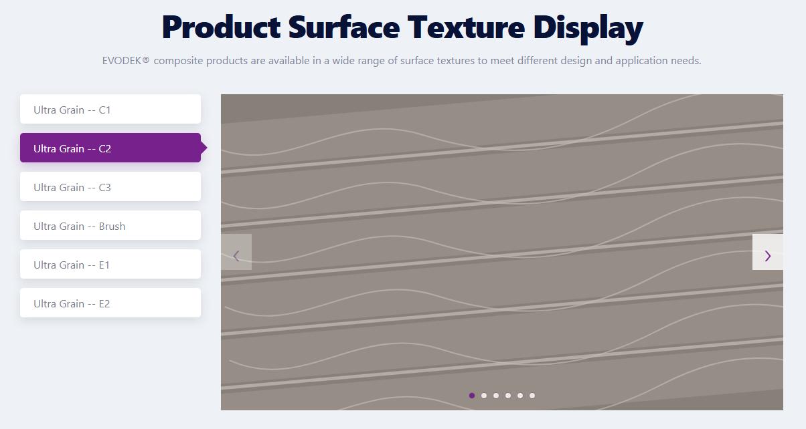

## 效果说明

左侧为产品表面纹理类型，右侧为当前纹理对应的一组图片 Gallery。

整体关系：

```text
一个纹理
↔
一组 Gallery
↔
一个共享 Swiper
```

例如：

```text
Ultra Grain -- C1
→ 6 张图片

Ultra Grain -- C2
→ 6 张图片

Ultra Grain -- C3
→ 6 张图片
```

## 亮点

- 左侧纹理 Tabs
- 当前项紫色高亮
- 激活项带方向箭头
- 每个纹理对应多张图片
- 所有纹理共用一个 Swiper
- 左右箭头控制当前 Gallery
- 分页圆点
- 手机手势
- `<template>` 保存每组图片
- 切换纹理时自动回到第 1 张
- 手机端 2 × 3 分类菜单
- 手机 Gallery 使用 4:3

## 应用场景

适合：

- 产品表面纹理
- 木纹展示
- 材质选择
- 饰面选择
- 产品款式
- 表面工艺
- 产品详情页
- WooCommerce 产品扩展展示

## 技术

```text
HTML5
CSS Grid
原生 JavaScript
HTML <template>
Swiper Gallery
Responsive Layout
```

## WordPress 扩展方向

后期可以让 WordPress PHP 直接输出：

```php
<template data-texture="c1">

    <?php foreach ( $gallery_ids as $image_id ) : ?>

        <figure class="swiper-slide">
            <?php
            echo wp_get_attachment_image(
                $image_id,
                'large'
            );
            ?>
        </figure>

    <?php endforeach; ?>

</template>
```

不需要：

```text
AJAX
REST
JSON 数据文件
JS 图片数组
```

仍然保持：

> **WordPress 管数据，JavaScript 管交互。**

---

# 11 个案例快速对照

| Section | 组件 | 核心交互 | JS / Library |
|---|---|---|---|
| 01 | 工程案例分类 | Tabs 切换 | 原生 JS |
| 02 | 热销产品 | 交错图文 | 无 |
| 03 | 产品色卡 | 色卡 + Fade 轮播 | Swiper |
| 04 | 荣誉资质 | 分类 + 证书轮播 + 放大 | Swiper + Modal |
| 05 | 图片式发展历程 | Timeline 联动 | Swiper |
| 06 | 企业文化 | Hover 内容层 | 无 |
| 07 | 工程案例图库 | Modal + Gallery | Swiper + 原生 JS |
| 08 | 产品优势 | Hover 背景图片 | 无 |
| 09 | Footer | 响应式 Footer | 无 |
| 10 | 卡片式发展历程 | 横向 Timeline | Swiper |
| 11 | 产品表面纹理 | Tabs + 多图 Gallery | Swiper + `<template>` |

---

# 推荐使用方式

## 方法一：独立学习

直接打开任意目录中的：

```text
index.html
```

即可单独研究该组件。

适合：

- 学习 HTML 结构
- 学习 CSS Grid / Flexbox
- 学习响应式
- 学习 Swiper
- 学习 Modal
- 学习组件作用域

---

## 方法二：复制到现有项目

选择需要的 Section，例如：

```text
section08-product-advantages/
```

复制：

```text
HTML Section
+
对应 CSS
+
images
```

如果有 JS：

```text
+
js/app.js
```

如果使用 Swiper：

```text
+
vendor/swiper/
```

即可。

---

## 方法三：迁移到 WordPress

建议遵循：

```text
HTML 内容
↓
替换为 PHP / WordPress 数据调用

CSS
↓
基本保留

JavaScript
↓
基本保留
```

例如：

```html

```

可以替换为：

```php
<?php echo wp_get_attachment_image( $image_id, 'large' ); ?>
```

组件不需要因为迁移到 WordPress 而完全重写。

---

# 开发规范

## CSS

所有组件规则必须以 Section ID 开头：

```css
#section03 .item {}
#section03 .title {}
```

不要写：

```css
.item {}
.title {}
```

---

## JavaScript

先锁定当前组件：

```js
const root = document.querySelector('#section03');

if (!root) return;
```

之后：

```js
root.querySelector(...)
root.querySelectorAll(...)
```

避免影响页面中其他 Section。

---

## 数据

优先放在：

```text
HTML
WordPress
<template>
data-*
```

尽量不要把：

```text
产品名称
型号
颜色
项目说明
图片 URL
```

写死进 JavaScript。

---

# 响应式原则

本项目主要参考：

```text
Desktop
Tablet
Mobile
```

常用断点：

```css
@media (max-width: 991px) {}
@media (max-width: 767px) {}
```

特殊情况下才增加：

```css
@media (max-width: 380px) {}
```

目标不是追求断点数量，而是保证：

- 桌面端结构清晰
- 平板合理折叠
- 手机端容易操作
- 不出现横向页面滚动
- 图片比例稳定
- 内容长度变化时布局仍然自然

---

# 图片替换建议

当前仓库中的 SVG 主要用于演示布局和交互。

正式项目中可以替换为：

```text
JPG
WebP
PNG
SVG
```

建议优先使用：

```text
WebP
```

并根据组件特点准备统一比例图片。

常见原则：

```css
object-fit: cover;
```

避免因原图比例不同破坏布局。

---

# Swiper 使用原则

本项目中的 Swiper 使用本地文件：

```text
vendor/swiper/
├── swiper-bundle.min.css
└── swiper-bundle.min.js
```

不依赖远程 CDN。

Swiper 主要用于：

```text
Section 03
Section 04
Section 05
Section 07
Section 10
Section 11
```

简单 Section 不为了“使用框架”而引入 Swiper。

---

# 长期维护原则

这套组件库的重点不是不断增加效果，而是保持每个组件：

```text
简单
独立
稳定
容易读懂
容易复制
容易修改
容易迁移
```

推荐长期遵守：

```text
内容 → HTML / WordPress
布局 → CSS
交互 → JavaScript
轮播 → Swiper
详情数据 → <template> / WordPress
```

避免把所有功能堆进：

```text
一个大型 CSS
一个大型 app.js
一个复杂框架
```

---

# 总结

这 11 个 Section 基本覆盖了现代企业官网中非常常见的一批核心布局：

```text
工程案例
产品推荐
颜色选择
荣誉证书
发展历程
企业文化
项目 Gallery
产品优势
Footer
公司时间轴
产品表面纹理
```

它们既可以作为：

> **前端布局实验**

也可以逐步沉淀成：

> **自己的企业网站 Section 组件库**

后期再结合 WordPress 内容模型、Custom Post Type、Meta Fields 和 Gutenberg Block，就可以逐步形成一套更加完整的企业网站快速开发体系。
